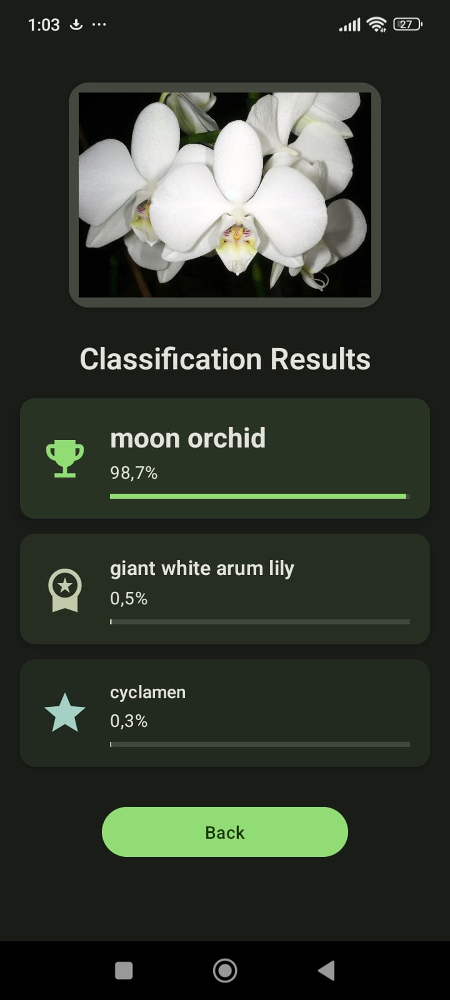

# Florify

An Android app that classifies flower species using a self-developed machine learning model. Built with Kotlin and Jetpack Compose.

## Interface

  
  

## Features

- Real-time camera preview with CameraX
- Gallery image selection
- On-device TensorFlow Lite classification
- Top 3 results with confidence scores

## Tech Stack

- **Language**: Kotlin
- **UI**: Jetpack Compose with Material 3
- **ML**: TensorFlow Lite 0.4.0
- **Camera**: CameraX 1.3.0
- **Min SDK**: 26 (Android 8.0)

## Installation

1. Clone the repository
2. Open in Android Studio
3. Sync Gradle dependencies
4. Run on device or emulator (API 26+)

## How It Works

1. Capture or select an image
2. Image is preprocessed (resized to 224x224, normalized)
3. TensorFlow Lite model classifies the flower
4. Top 3 matches displayed with confidence percentages